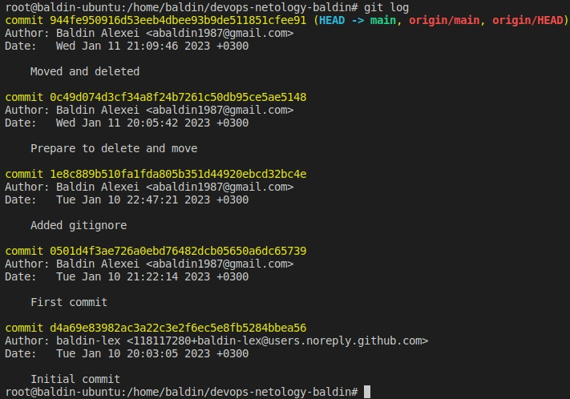

# devops-netology-baldin

## Задание 1. Создать и настроить репозиторий для дальнейшей работы на курсе.

#### ***Прошелся по всем пунктам задания. Прилагаю результат вывода*** `git log`:

#### ***Если я правильно понял задачу №4 в блоке "Создание файлов .gitignore и второго коммита", то от меня требуется описать в этом README-файле исключения, описанные в ~/devops-netology-baldin/terraform/.gitignore. Тогда:***

`**/.terraform/*` - позволит игнорировать директории .terraform любой степени вложенности вместе с вложенными в них директориями и файлами.

`*.tfstate` и `*.tfstate.*` - для исключения файлов состояния Terraform, которые имеют такое расширение. 

`crash.log` и `crash.*.log` - для игнорирования файлов журналов ошибок. Без данного правила репозиторий будет разрастаться с каждым коммитом.

`*.tfvars` и `*.tfvars.json` - для исключения файлов переменных. Как следует из комментария автора, они могут содержать конфиденциальную информацию.

`override.tf`, `override.tf.json`, `*_override.tf` и `*_override.tf.json` - для исключения файлов переопределения ресурсов terraform.

`.terraformrc` и `terraform.rc` - позволит игнорировать файлы конфигурации интерфейса командной строки.

----

## Задание 2. Знакомство с документаций

#### ***Со справкой по `git --help`, `git add --help` ознакомился***

Внес изменения в рамках задания №4 

